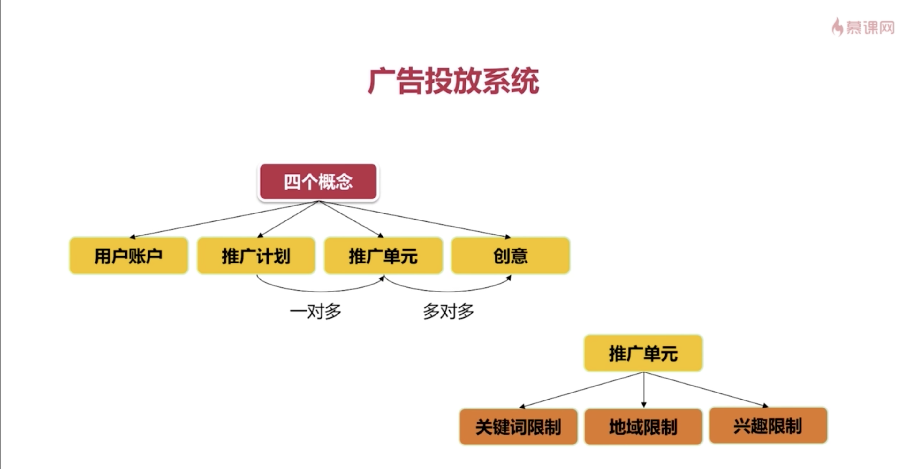
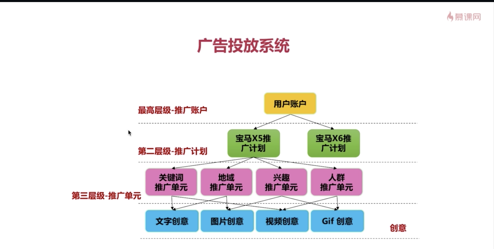

# 广告投放系统开发

### 一. 广告投放系统概述

1. 用户账户：**最高层级，用于定义广告主或代理商，只有有了用户才会有接下来的数据投放**。
2. 推广计划：**一类品牌或产品广告投放的规划，并不定义太多关于广告自身的信息，它会将信息打包下放到推广单元层级**。**一个推广计划可以包含一个或多个推广单元。**
3. 推广单元(推广维度)：**一个确定的广告投放策略，描述了投放广告的规则信息**。推广单元包含一些不同维度的限制。
4. 推广单元维度限制：**广告投放会有一些限制条件，例如只投放到北京、上海地区，或只对一些关键字进行投放等等。** 
5. 创意(广告物料)：**命中一个推广单元后，展示给用户看到的数据，可以是图片、文本或者一段视频等等**。

层级关系：

### 二. 表结构设计

