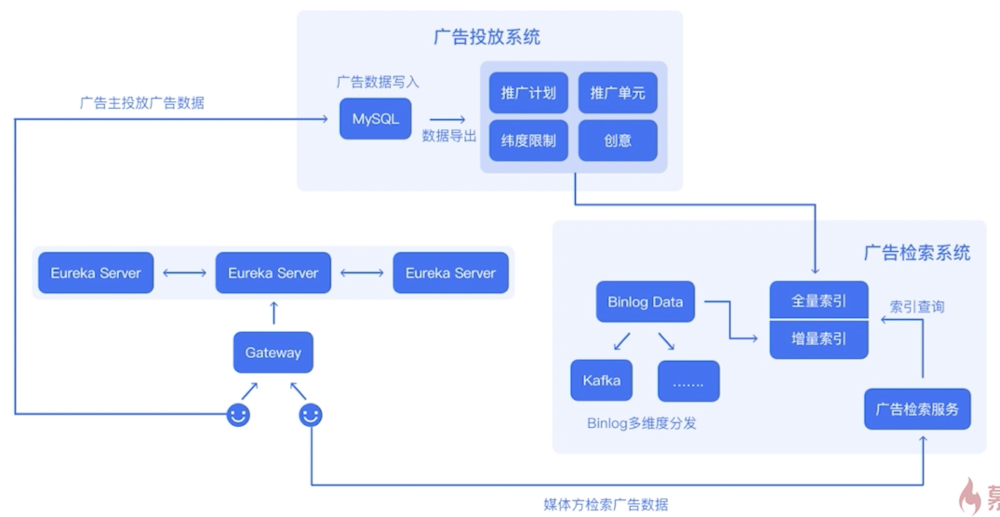
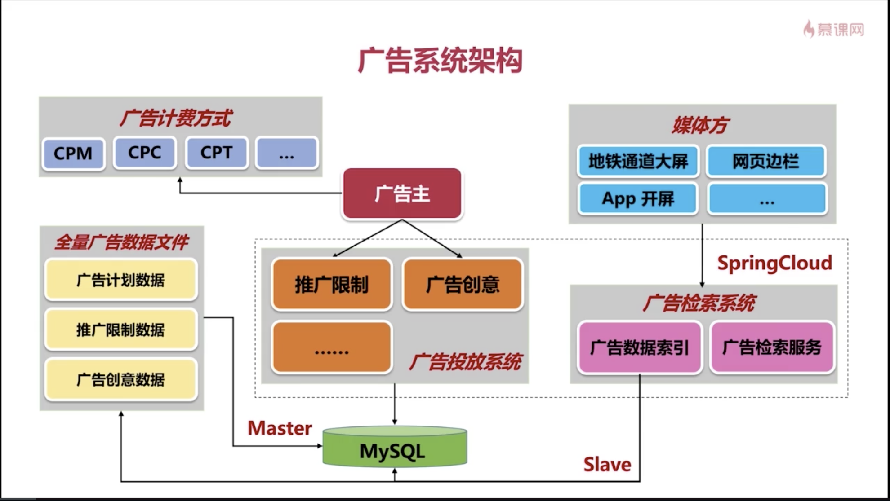
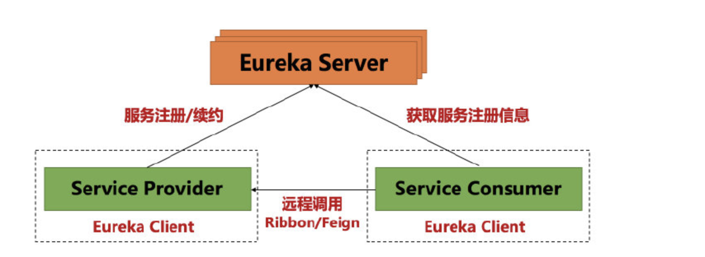
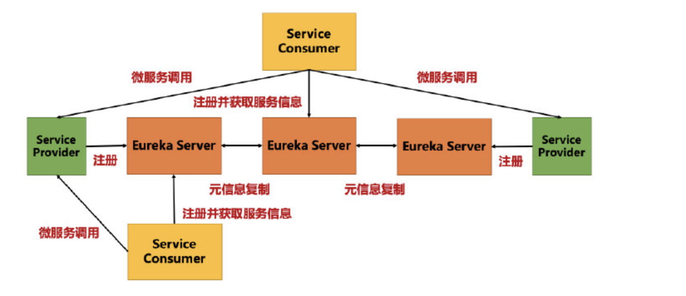

# 广告系统开发

### 一. 广告系统概览

1. 项目架构
  
   
   
2. 广告系统主要实现的功能：

   1. 广告主的广告投放
      1. 推广计划
      2. 推广单元
   2. 媒体方的广告**曝光**
      1. 媒体方：能够展示广告的媒介(如地铁的广告屏、网页边栏、APP开屏等)

3. 广告计费方式
   1. CPM：Cost Per Mille，按照展示次数收费，每展示一千次需要多少钱；
   2. CPT：Cost Per Time，按照时长收费，如每小时多少钱；
   3. CPC：Cost Per Click，按照点击收费，每产生一次点击多少钱(多用于点击类的竞价广告)。

### 二. 一个完整的广告系统所包含的子系统

1. **广告投放系统**：既然是广告系统，一定得有广告数据，数据当然是由广告主或代理商投放，那么，也就需要有个投放广告的平台，这就是广告投放系统。**广告投放系统是广告系统的最前端，与广告主或代理商直接对接**；
2. **广告检索系统**：媒体方对广告系统发起请求，广告系统能够检索符合要求的广告数据，这就是广告检索系统的核心功能 。**广告检索系统是整个广告系统最核心的模块**；
3. 曝光监测系统：监测广告数据的曝光记录。广告系统和广告主都可能有各自的曝光监测系统，用于费用的计算；
4. 扣费系统： 广告的每一次曝光都是需要扣费的，且这个系统里面负责了将广告数据置位的功能。扣费系统主要功能就是实时监测广告曝光数据，并扣除广告主的相关费用；
5. 报表系统：构建广告数据报表，比如广告A在地域B中一共曝光了多少次，主要是 OLAP 的过程。

### 三. 使用到的技术

1. Spring Cloud：微服务框架
2. MySQL：存储广告数据，并且存储系统会监听MySQL，进行增量索引
3. Kafka：消息系统，实现各个服务之间的通信

### 四. 广告系统的扩展

1. 更多的维度：如地域维度、年龄维度、兴趣维度等；
2. 用户画像：提高广告曝光的精准度
3. AI

### 五. 广告系统的架构

### 六. 工程结构

Ad-system：父工程，主要负责依赖管理

​	ad-eureka：使用Eurake实现的服务注册与发现中心

​	ad-gateway：使用Zuul实现的微服务网关

​	ad-service：广告核心系统

​		ad-common：通用代码与配置等

​		ad-dashboard：基于Hystrix实现的监控

​		ad-search：广告检索子系统

​		ad-sponsor：广告投放子系统

### 七. Eureka简介

1. 基本功能：

   1. Service Registry 服务注册
   2. Service Discovery 服务发现

2. 基本架构

   

   1. Eureka Server：提供服务注册和服务发现的功能
   2. Eureka Client：相对于Eureka Server的客户端，需要向Eureka Server注册
      1. Service Provider：服务提供方，将自身服务注册到Eureka Server上，从而让Eureka Server持有服务的元信息。服务消费方可以通过Eureka Server发现当前服务。
      2. Service Consumer：服务消费方，从Eureka Server上获取服务注册表，进行服务的消费。

3. Eureka Server的高可用

   1. 单节点：**单点故障问题**。整个系统所有的服务元信息都保存在一个Eureka Server节点上，一旦该节点故障，将导致所有服务信息丢失，造成整个系统的瘫痪。

   2. 高可用架构

      

### 八. 微服务网关

1. 微服务架构方式
   1. 点对点：服务之间直接调用，每个服务开放API供其他服务调用。
   2. API网关方式：业务接口通过API网关对外暴露，**API网关是所有客户端访问的唯一入口**。微服务之间也通过API网关通信。